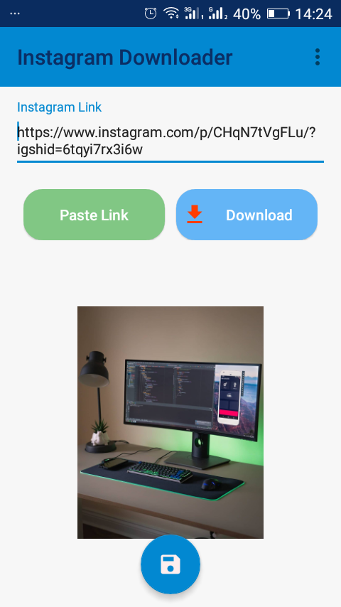

# Instagram Downloader

## Introduction
Simple app for  Instagram Photo downloader

## Screen

  

  

## Architecture
The architecture of this application relies and complies with the following points below:
* A single-activity architecture, using the [Navigation Components](https://developer.android.com/guide/navigation) to manage fragment operations.
* Pattern [Model-View-ViewModel](https://en.wikipedia.org/wiki/Model%E2%80%93view%E2%80%93viewmodel)(MVVM) which facilitates a separation of development of the graphical user interface.
* [Android architecture components](https://developer.android.com/topic/libraries/architecture/) which help to keep the application robust, testable, and maintainable.

## Technologies used:

* [ViewModel](https://developer.android.com/topic/libraries/architecture/viewmodel) to store and manage UI-related data in a lifecycle conscious way.
* [LiveData](https://developer.android.com/topic/libraries/architecture/livedata) to handle data in a lifecycle-aware fashion.
* [Navigation Component](https://developer.android.com/guide/navigation) to handle all navigations and also passing of data between destinations.
* [Kotlin Coroutines](https://kotlinlang.org/docs/reference/coroutines-overview.html) for managing background threads and reducing needs for callbacks.
* [Data Binding](https://developer.android.com/topic/libraries/data-binding/) to declaratively bind UI components in layouts to data sources.
* [Retrofit](https://square.github.io/retrofit/) 
* [OkHttp](https://square.github.io/okhttp/) .

